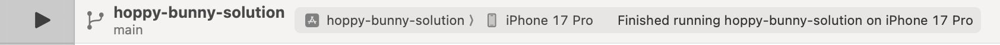
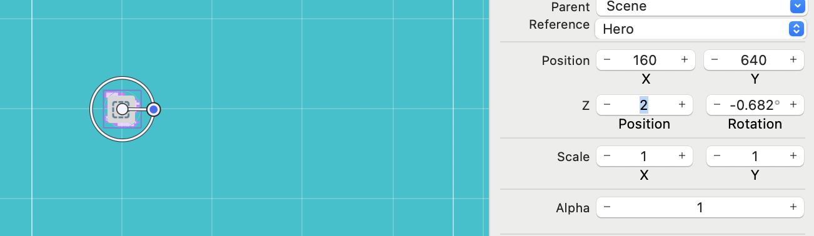

# You've got to let the bunny fly!

Time to setup physics for your game world and game play objects.

# SpriteKit Physics

You will be using the powerful physics engine built into SpriteKit, thankfully
it's as easy as ticking a box to enable physics for each of our game objects. I
recommend you have a read of
[Getting Started with Physics](https://developer.apple.com/documentation/spritekit/getting-started-with-physics)
as physics plays a key role in many games, a game may not even appear to be
physics based yet will often use physics for collision detection as this on its
own is a powerful feature.

## Make the ground static

> [action] Open `GameScene.sks` and select the `ground` node, ensure the
> _Attributes inspector_ is open and scroll down until you see the _Physics
> Definition_ option. Set the _Body Type_ to `Bounding rectangle`, which will
> present you will the additional physics properties. Set the body to be
> `static` by unchecking `dynamic`, there is no need for it to rotation so
> uncheck `Allows Rotation`, there is also no need for it to be affected by
> gravity, so deselect `Affected By Gravity`.
>
> 

## Enable bunny physics

> [action] Open `Hero.sks` and select the `Bunny` sprite. Find the physics
> definition section and Set _Body Type_ to `Bounding circle`. You should notice
> a faint circle around the bunny to show the physics body. Next check the
> following boxes _Dynamic_, _Allow Rotation_ and _Affected By Gravity_. (By
> default they should all be checked).
>
> Set _Friction_ to `0`. This will prevent the Bunny from sliding along the
> ground, this will help as the tutorial progresses.
>
> 

<!--  -->

> [info] You might wonder why we only used a circle for our bunny physics
> definition. When it comes to physics, less is always more, physics can be
> intensive on mobile devices and you want to simplify life as much as possible
> for the physics engine. Circles provide the best performance and if you can
> get away with just a circle then use it, the trick is using the most efficient
> shape for the job at hand.

## Adding the bunny to the world

> [action] To add the bunny to the game scene, open GameScene, then drag the `Hero.sks` file into the
> scene. This will automatically create a _Reference node_ pointing to the
> `Hero.sks`
>
> 
>
> Set the position to `(187, 640)`. 
>
> NOTE! These numbers may need some adjustments to accomodate new screen dimensions.

<!--  -->

> [info] Often _Reference nodes_ are not displayed properly when initially
> placed into a scene, a quick _Save_ of the scene should rectify this.

## Gravity

If you click outside of our _GameScene_ white box and check the _Attributes
inspector_ you will see our physics world will default to approximate Earth's
gravity `-9.8`.


> [info] Also notice the _Debug Drawing_ options in the inspector, the _Show
> Physics Boundaries_ is handy to check that your physics is where you think it
> should be. This creates the faint blue outlines.

## Adding the crystals

> [action] Let's add some pretty crystals above the ground to complete the
> visual appeal of _Hoppy Bunny Swift_ by dragging `bg_crystals.png` into the
> scene from the Media Library:
>
> 
>
> Snap it top the top of _ground_ by setting the _Position_ to `(375, 278.5)`.
>
> NOTE! These values need adjustment for the new screen dimensions. 

# Check your progress

Let's check that gravity is running correctly, SpriteKit Scene editor allows you
to check this without having to run the game. Select `Animate` in
`GameScene.sks` as you did before in `Hero.sks`:

**You should see the animated hero succumb to the gravity and fall to the
ground.** If it doesn't please go back and double check your work so far :]


> [action] Before you hit that `Run`, you need to clear out the default project
> template code. Open `GameScene.swift` and replace with the following:
>
```
import SpriteKit
import GameplayKit

class GameScene: SKScene {
    override func didMove(to view: SKView) {
        /* Setup your scene here */
    }

    override func touchesBegan(_ touches: Set<UITouch>, with event: UIEvent?) {
        /* Called when a touch begins */
    }

    override func update(_ currentTime: TimeInterval) {
        /* Called before each frame is rendered */
    }
}
```

NOTE! I had a problem with game at this stage where everything was zoomed in, the screen appeared brown becuase I was viewing the ground up close. I needed to make the following changes. These affected the size and position elements. 

- Open GameScene.sks. Select the top level node: Scene. In the inspector set scale to 2. 
- Select the ground. Set the position x: 377, y: 32. 
- Select the clouds. Set the position x: 375, y: 1011. 
- Select the Hero sprite. Set position x: 160, y: 640.
- Select the crystals. Set position x: 377, y: 278.5.

You can use other values, these are the values I will use for the rest of the tutorial.

## Action

Now it's time to hit `Run` and see your game running in action.



# Z Position

Argghh, it looks weird, the bunny is behind the crystals!


In SpriteKit there is no implied object rendering order, so all objects are
rendered by default at a _Z-Position_ of `0`. So if your bunny is at the same
position as the crystals, you will have unpredictable rendering results.

NOTE! When I created the project the z-order was not a problem. The hero stacked in front of the crystals. I set the z-order below anyway. 

_Wait, so what is Z Position?_

Z-Position or Z-Order defines the render ordering for overlapping 2d objects.


Rectangle B is drawn after rectangle A. The result is rectB is drawn “above”
rectA. RectB is said to have higher _Z-Position_ than rectA.

You can easily set the _Z-Position_ of your sprites in the _Attributes
inspector_:



> [action] Keep it logical, imagine you are painting a scene, work from the back
> to the front. Set the z position of the `crystals` and `ground` to `0`. Set
> the `clouds` to z position `1`. Last put our `bunny` on top of everything with
> a value of `2`.
>
> **Run the project again and it should look perfect now.**

Well, almost perfect: you may have noticed your bunny isn't flapping its ears!
We're going to fix that in the next chapter!

# Summary

It's coming along nicely now, so what did you learn?

- Added basic physics to the game
- Learned how to use a reference node
- Used **Z-Position** to layer your sprites
- Finally got to run the game

Next chapter you will be adding player controls to the hero.
